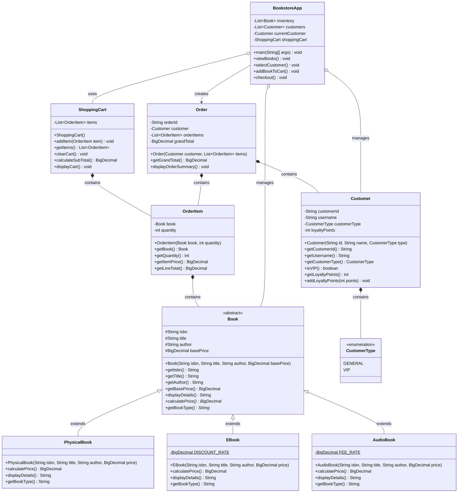

# Java Bookstore Application - Object-Oriented Programming Class Diagram

This diagram showcases the comprehensive object-oriented design of the Java Bookstore Application, demonstrating key OOP principles including inheritance, polymorphism, composition, and aggregation.

## Object-Oriented Programming Concepts Demonstrated

### 1. **Inheritance** (`<|--`)
- **Book** (abstract base class) → **PhysicalBook**, **EBook**, **AudioBook**
- Demonstrates the IS-A relationship where specialized book types inherit common properties and behaviors

### 2. **Polymorphism**
- Abstract methods `calculatePrice()` and `getBookType()` implemented differently in each book subclass
- **EBook**: Applies 10% discount
- **AudioBook**: Adds 5% processing fee
- **PhysicalBook**: Uses base price

### 3. **Composition** (`*--`)
- **Strong ownership relationships** where child objects cannot exist without parent:
  - Customer contains CustomerType (enum)
  - OrderItem contains Book reference
  - ShoppingCart contains OrderItem objects
  - Order contains Customer and OrderItem references

### 4. **Aggregation** (`o--`)
- **Weak association relationships** where objects can exist independently:
  - BookstoreApp aggregates Book inventory
  - BookstoreApp aggregates Customer list
  - BookstoreApp aggregates ShoppingCart

### 5. **Association** (`-->`)
- **BookstoreApp** creates and manages **Order** objects during checkout process

### 6. **Encapsulation**
- **Private fields** (`-`): Internal data hidden from external access
- **Protected fields** (`#`): Available to subclasses only
- **Public methods** (`+`): External interface for object interaction

### 7. **Design Patterns**
- **Template Method**: Book class defines structure, subclasses implement specific behavior
- **Strategy Pattern**: Different pricing strategies per book type
- **Facade Pattern**: BookstoreApp provides simplified interface to complex subsystem
- **Composition Pattern**: Order composed of multiple OrderItems

### 8. **Generic Types**
- **List~Book~**: Type-safe collections for inventory
- **List~Customer~**: Type-safe customer management
- **List~OrderItem~**: Type-safe order item collections

This design demonstrates clean separation of concerns, proper encapsulation, and extensible architecture suitable for enterprise-level applications.
