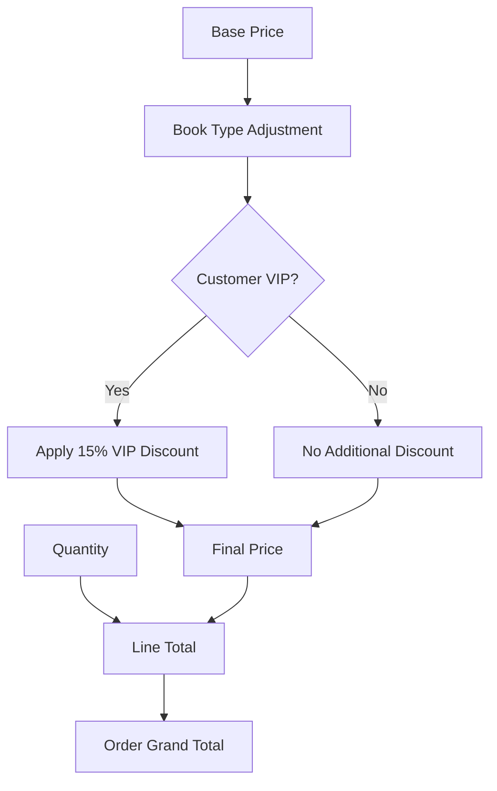

# Java Bookstore Application - Technical Architecture Deep Dive

---

## 🏗️ System Architecture Overview

### **Hexagonal Architecture Implementation**

```
┌─────────────────────────────────────────────────────────────┐
│                      BookstoreApp                          │ ← Driving Adapter
│                   (Console Interface)                       │
├─────────────────────────────────────────────────────────────┤
│                  Application Services                       │
│  ┌─────────────────┐  ┌─────────────────┐  ┌──────────────┐ │
│  │ BookService     │  │ CustomerService │  │ OrderService │ │
│  │ (Use Cases)     │  │ (Use Cases)     │  │ (Use Cases)  │ │
│  └─────────────────┘  └─────────────────┘  └──────────────┘ │
├─────────────────────────────────────────────────────────────┤
│                     Domain Core                             │ ← Business Logic
│  ┌─────────────────┐  ┌─────────────────┐  ┌──────────────┐ │
│  │ Book Aggregate  │  │ Customer Root   │  │ Order Root   │ │
│  │ • Book Entity   │  │ • Customer      │  │ • Order      │ │
│  │ • Book Types    │  │ • CustomerType  │  │ • OrderItem  │ │
│  │ • Pricing Rules │  │ • Loyalty Logic │  │ • Cart Logic │ │
│  └─────────────────┘  └─────────────────┘  └──────────────┘ │
├─────────────────────────────────────────────────────────────┤
│                   Infrastructure Ports                      │ ← Driven Adapters
│  ┌─────────────────┐  ┌─────────────────┐  ┌──────────────┐ │
│  │ BookRepository  │  │ CustomerRepo    │  │ OrderRepo    │ │
│  │ PaymentGateway  │  │ NotificationSvc │  │ AuditService │ │
│  └─────────────────┘  └─────────────────┘  └──────────────┘ │
└─────────────────────────────────────────────────────────────┘
```

### **Domain-Driven Design Structure with Tactical Patterns**

```
com.bookstore/
├── app/                    # Application Layer
│   ├── BookstoreApp.java              # Primary Adapter (Console)
│   ├── services/                      # Application Services
│   │   ├── BookApplicationService.java     # Book Use Cases
│   │   ├── CustomerApplicationService.java # Customer Use Cases
│   │   └── OrderApplicationService.java    # Order Use Cases
│   └── dto/                           # Data Transfer Objects
│       ├── BookDTO.java
│       ├── CustomerDTO.java
│       └── OrderDTO.java
├── books/                  # Book Bounded Context
│   ├── domain/                        # Domain Layer
│   │   ├── Book.java                      # Entity (Aggregate Root)
│   │   ├── PhysicalBook.java              # Entity
│   │   ├── EBook.java                     # Entity
│   │   ├── AudioBook.java                 # Entity
│   │   ├── BookId.java                    # Value Object (Identity)
│   │   ├── ISBN.java                      # Value Object
│   │   ├── Price.java                     # Value Object
│   │   ├── BookFactory.java               # Factory
│   │   └── PricingStrategy.java           # Strategy Interface
│   ├── infrastructure/                # Infrastructure Layer
│   │   ├── BookRepository.java            # Repository Interface
│   │   └── InMemoryBookRepository.java    # Repository Implementation
│   └── application/               # Application Services
│       └── BookService.java               # Book Use Cases
├── customer/               # Customer Bounded Context
│   ├── domain/                        # Domain Layer
│   │   ├── Customer.java                  # Aggregate Root
│   │   ├── CustomerId.java                # Value Object (Identity)
│   │   ├── CustomerType.java              # Value Object (Enum)
│   │   ├── LoyaltyPoints.java             # Value Object
│   │   ├── CustomerFactory.java           # Factory
│   │   └── LoyaltyCalculator.java         # Domain Service
│   ├── infrastructure/                # Infrastructure Layer
│   │   ├── CustomerRepository.java        # Repository Interface
│   │   └── InMemoryCustomerRepository.java # Repository Implementation
│   └── application/               # Application Services
│       └── CustomerService.java           # Customer Use Cases
└── order/                  # Order Bounded Context
    ├── domain/                        # Domain Layer
    │   ├── Order.java                     # Aggregate Root
    │   ├── OrderId.java                   # Value Object (Identity)
    │   ├── OrderItem.java                 # Entity
    │   ├── OrderStatus.java               # Value Object (Enum)
    │   ├── ShoppingCart.java              # Domain Service
    │   ├── OrderFactory.java              # Factory
    │   ├── PricingEngine.java             # Domain Service
    │   └── events/                        # Domain Events
    │       ├── OrderCreated.java              # Domain Event
    │       ├── OrderCompleted.java            # Domain Event
    │       └── CustomerUpgraded.java          # Domain Event
    ├── infrastructure/                # Infrastructure Layer
    │   ├── OrderRepository.java           # Repository Interface
    │   └── InMemoryOrderRepository.java   # Repository Implementation
    └── application/               # Application Services
        └── OrderService.java               # Order Use Cases
```

### **Architectural Layers & Responsibilities**

| **Layer** | **Components** | **Responsibilities** | **Dependencies** |
|-----------|----------------|---------------------|------------------|
| **Application** | BookstoreApp | UI, Input/Output, Orchestration | Domain Layer |
| **Domain** | Entities, Value Objects | Business Logic, Domain Rules | None (Pure) |
| **Infrastructure** | (Future: DB, APIs) | Data Persistence, External Services | Domain Layer |

### **Advanced Enterprise Patterns Implementation**

| **Pattern** | **Purpose** | **Implementation** | **Benefit** |
|-------------|-------------|-------------------|-------------|
| **Aggregate Root** | Consistency boundary | `Order`, `Customer`, `Book` | Transaction integrity |
| **Value Object** | Immutable data | `Price`, `ISBN`, `CustomerId` | Type safety |
| **Domain Service** | Cross-aggregate logic | `PricingEngine`, `LoyaltyCalculator` | Business logic encapsulation |
| **Factory** | Complex object creation | `BookFactory`, `OrderFactory` | Encapsulates creation logic |
| **Repository** | Data access abstraction | `BookRepository`, `CustomerRepository` | Persistence independence |
| **Domain Event** | Decoupled communication | `OrderCompleted`, `CustomerUpgraded` | Loose coupling |
| **Specification** | Business rule validation | `VipEligibilitySpec`, `BookAvailabilitySpec` | Reusable business rules |

### **SOLID Principles - Advanced Implementation**

#### **Single Responsibility Principle (SRP) - Granular**
```java
// Each class has ONE cohesive responsibility
public class Book {                    // Data + Book-specific behavior
public class PricingEngine {           // Pricing calculations only
public class LoyaltyCalculator {       // Loyalty point logic only
public class OrderValidator {          // Order validation rules only
public class CustomerFactory {         // Customer creation logic only
public class BookDisplayFormatter {    // Presentation formatting only
```

#### **Open/Closed Principle (OCP) - Strategy Pattern**
```java
// Strategy interface for pricing
public interface PricingStrategy {
    BigDecimal calculatePrice(Book book, Customer customer);
}

// Concrete strategies - add new without modifying existing
public class StandardPricingStrategy implements PricingStrategy {
    @Override
    public BigDecimal calculatePrice(Book book, Customer customer) {
        return book.getBasePrice();
    }
}

public class VipPricingStrategy implements PricingStrategy {
    private static final BigDecimal VIP_DISCOUNT = new BigDecimal("0.15");
    
    @Override
    public BigDecimal calculatePrice(Book book, Customer customer) {
        BigDecimal basePrice = book.getBasePrice();
        if (customer.isVIP()) {
            return basePrice.multiply(BigDecimal.ONE.subtract(VIP_DISCOUNT));
        }
        return basePrice;
    }
}

// Context class - closed for modification, open for extension
public class PricingEngine {
    private final PricingStrategy strategy;
    
    public PricingEngine(PricingStrategy strategy) {
        this.strategy = strategy;
    }
    
    public BigDecimal calculateFinalPrice(Book book, Customer customer) {
        return strategy.calculatePrice(book, customer);
    }
}
```

#### **Liskov Substitution Principle (LSP) - Behavioral Compatibility**
```java
// Contract: All Book subtypes must behave consistently
public abstract class Book {
    // Precondition: basePrice must be positive
    // Postcondition: calculatePrice() must return positive value
    public abstract BigDecimal calculatePrice();
    
    // Invariant: ISBN format must remain valid throughout object lifetime
    public final boolean isValidIsbn() {
        return isbn != null && isbn.matches("\\d{13}");
    }
}

// All implementations maintain the contract
public class PhysicalBook extends Book {
    @Override
    public BigDecimal calculatePrice() {
        // Honors postcondition: always returns positive price
        return basePrice; // Never null, never negative
    }
}

public class EBook extends Book {
    @Override
    public BigDecimal calculatePrice() {
        // Honors postcondition: even with discount, returns positive
        BigDecimal discounted = basePrice.multiply(new BigDecimal("0.90"));
        return discounted.max(BigDecimal.ONE); // Minimum $1.00
    }
}
```

#### **Interface Segregation Principle (ISP) - Role-based Interfaces**
```java
// Segregated interfaces - clients depend only on what they need
public interface Purchasable {
    BigDecimal calculatePrice();
    boolean isAvailable();
}

public interface Displayable {
    String getTitle();
    String getAuthor();
    String formatDisplayName();
}

public interface Searchable {
    String getIsbn();
    Set<String> getKeywords();
    boolean matchesQuery(String query);
}

public interface Trackable {
    LocalDateTime getCreatedDate();
    int getViewCount();
    void incrementViewCount();
}

// Classes implement only relevant interfaces
public class Book implements Purchasable, Displayable, Searchable {
    // No forced implementation of tracking features
}

public class BookStatistics implements Trackable {
    // Only implements tracking, not purchasing
}
```

#### **Dependency Inversion Principle (DIP) - Abstraction Layers**
```java
// High-level policy (Application Service)
public class OrderApplicationService {
    private final OrderRepository orderRepository;           // Abstraction
    private final CustomerRepository customerRepository;     // Abstraction
    private final BookRepository bookRepository;             // Abstraction
    private final PricingEngine pricingEngine;              // Abstraction
    private final DomainEventPublisher eventPublisher;      // Abstraction
    
    // Depends on abstractions, not concretions
    public OrderApplicationService(
        OrderRepository orderRepository,
        CustomerRepository customerRepository,
        BookRepository bookRepository,
        PricingEngine pricingEngine,
        DomainEventPublisher eventPublisher) {
        // Dependency injection of abstractions
    }
    
    public Order createOrder(String customerId, List<OrderItemRequest> items) {
        // High-level algorithm using abstractions
        Customer customer = customerRepository.findById(customerId);
        Order order = new Order(customer);
        
        for (OrderItemRequest item : items) {
            Book book = bookRepository.findById(item.getBookId());
            BigDecimal price = pricingEngine.calculatePrice(book, customer);
            order.addItem(book, item.getQuantity(), price);
        }
        
        Order savedOrder = orderRepository.save(order);
        eventPublisher.publish(new OrderCreated(savedOrder.getId()));
        return savedOrder;
    }
}

// Low-level details (Infrastructure)
public class InMemoryOrderRepository implements OrderRepository {
    // Concrete implementation depends on abstraction
}
```
}

public class DigitalMagazine extends Book { // New type without modifying base
    @Override
    public BigDecimal calculatePrice() { /* custom logic */ }
}
```

#### **Liskov Substitution Principle (LSP)**
```java
// Any Book subtype can replace Book without breaking functionality
List<Book> inventory = Arrays.asList(
    new PhysicalBook(...),  // Substitutable
    new EBook(...),         // Substitutable  
    new AudioBook(...)      // Substitutable
);

// Polymorphic behavior works correctly for all subtypes
for (Book book : inventory) {
    BigDecimal price = book.calculatePrice(); // Always works
}
```

#### **Interface Segregation Principle (ISP)**
```java
// Clients depend only on methods they use
public interface Purchasable {
    BigDecimal calculatePrice();
}

public interface Displayable {
    String displayDetails();
}

// Book implements only what it needs
public abstract class Book implements Purchasable, Displayable {
    // No forced implementation of unused methods
}
```

#### **Dependency Inversion Principle (DIP)**
```java
// High-level modules don't depend on low-level modules
public class Order {
    private Customer customer;     // Depends on abstraction
    private List<OrderItem> items; // Depends on abstraction
    
    // Not dependent on concrete implementations
    // Easy to mock for testing
}
```

---

## 📚 Book Management System - Advanced Implementation

### **Abstract Factory Pattern with Template Method**


### **Advanced Pricing Strategy Implementation**

#### **Strategy Pattern with Financial Precision**

```java
// Template Method in Book class
public abstract class Book {
    protected static final RoundingMode ROUNDING_MODE = RoundingMode.HALF_EVEN;
    
    // Template method - defines algorithm structure
    public String displayDetails() {
        return String.format("ISBN: %s, Title: %s, Author: %s, Base Price: $%s",
            isbn, title, author, 
            basePrice.setScale(2, ROUNDING_MODE));
    }
    
    // Strategy method - implemented by subclasses
    public abstract BigDecimal calculatePrice();
    
    // Hook method - can be overridden for additional behavior
    protected BigDecimal applyAdditionalFees(BigDecimal price) {
        return price; // Default: no additional fees
    }
}

// Concrete Strategy Implementations
public class EBook extends Book {
    private static final BigDecimal DISCOUNT_RATE = new BigDecimal("0.10");
    
    @Override
    public BigDecimal calculatePrice() {
        // Strategy: Apply percentage discount
        BigDecimal discountAmount = basePrice.multiply(DISCOUNT_RATE);
        BigDecimal discountedPrice = basePrice.subtract(discountAmount);
        return applyAdditionalFees(discountedPrice);
    }
    
    // Exposed for testing and transparency
    public BigDecimal getDiscountRate() {
        return DISCOUNT_RATE;
    }
}

public class AudioBook extends Book {
    private static final BigDecimal FEE_RATE = new BigDecimal("0.05");
    
    @Override
    public BigDecimal calculatePrice() {
        // Strategy: Apply processing fee
        BigDecimal feeAmount = basePrice.multiply(FEE_RATE);
        BigDecimal priceWithFee = basePrice.add(feeAmount);
        return applyAdditionalFees(priceWithFee);
    }
    
    @Override
    protected BigDecimal applyAdditionalFees(BigDecimal price) {
        // Hook: AudioBooks might have additional streaming costs
        return super.applyAdditionalFees(price);
    }
}
```

### **Comprehensive Pricing Matrix**

| **Book Type** | **Base Logic** | **Calculation** | **Example ($20)** | **Precision** |
|---------------|----------------|-----------------|-------------------|---------------|
| **PhysicalBook** | `basePrice` | `20.00` | $20.00 | 2 decimals |
| **EBook** | `basePrice × (1 - 0.10)` | `20.00 × 0.90` | $18.00 | 2 decimals |
| **AudioBook** | `basePrice × (1 + 0.05)` | `20.00 × 1.05` | $21.00 | 2 decimals |

### **Mathematical Precision Analysis**

```java
// Precision-critical calculation examples
public class PricingPrecisionDemo {
    
    public static void demonstrateRoundingModes() {
        BigDecimal testPrice = new BigDecimal("29.125");
        
        // HALF_UP: Always rounds .5 up
        BigDecimal halfUp = testPrice.setScale(2, RoundingMode.HALF_UP);
        // Result: 29.13
        
        // HALF_EVEN: Rounds .5 to nearest even number (Banker's rounding)
        BigDecimal halfEven = testPrice.setScale(2, RoundingMode.HALF_EVEN);
        // Result: 29.12 (2 is even, so round down)
        
        // Statistical bias over time
        // HALF_UP: +0.05 bias per .5 value
        // HALF_EVEN: ~0.00 bias (statistically neutral)
    }
    
    public static BigDecimal cumulativeErrorAnalysis(List<BigDecimal> prices) {
        BigDecimal totalHalfUp = BigDecimal.ZERO;
        BigDecimal totalHalfEven = BigDecimal.ZERO;
        
        for (BigDecimal price : prices) {
            totalHalfUp = totalHalfUp.add(price.setScale(2, RoundingMode.HALF_UP));
            totalHalfEven = totalHalfEven.add(price.setScale(2, RoundingMode.HALF_EVEN));
        }
        
        return totalHalfUp.subtract(totalHalfEven); // Shows cumulative bias
    }
}
```

---

## 👥 Customer Management System - Enterprise Pattern Implementation

### **Aggregate Root with Value Objects**


### **Advanced Customer State Management**

```java
public class Customer {
    private final String customerId;        // Immutable identifier
    private final String username;          // Immutable business key
    private CustomerType customerType;      // Mutable state
    private int loyaltyPoints;             // Mutable value
    private LocalDateTime createdAt;       // Audit field
    private LocalDateTime lastLogin;       // Behavioral tracking
    
    // Constructor with validation
    public Customer(String customerId, String username, CustomerType customerType) {
        this.customerId = Objects.requireNonNull(customerId, "Customer ID cannot be null");
        this.username = validateUsername(username);
        this.customerType = Objects.requireNonNull(customerType, "Customer type cannot be null");
        this.loyaltyPoints = 0; // New customers start with 0 points
        this.createdAt = LocalDateTime.now();
        this.lastLogin = LocalDateTime.now();
    }
    
    // Business rule: VIP status determination
    public boolean isVIP() {
        return customerType == CustomerType.VIP;
    }
    
    // Domain service method
    public boolean canReceiveVipDiscount() {
        return isVIP() && loyaltyPoints >= 0; // VIP with non-negative points
    }
    
    // Business logic: Loyalty point calculation
    public void addLoyaltyPoints(int points) {
        if (points < 0) {
            throw new IllegalArgumentException("Cannot add negative loyalty points");
        }
        
        int multiplier = customerType.getLoyaltyMultiplier();
        this.loyaltyPoints += (points * multiplier);
        
        // Domain event: Could trigger VIP upgrade
        checkForVipUpgrade();
    }
    
    // Private business logic
    private void checkForVipUpgrade() {
        if (customerType == CustomerType.GENERAL && loyaltyPoints >= 500) {
            this.customerType = CustomerType.VIP;
            // Domain event: Customer upgraded to VIP
        }
    }
    
    // Validation method
    private String validateUsername(String username) {
        if (username == null || username.trim().isEmpty()) {
            throw new IllegalArgumentException("Username cannot be null or empty");
        }
        if (username.length() < 3 || username.length() > 50) {
            throw new IllegalArgumentException("Username must be between 3 and 50 characters");
        }
        return username.trim();
    }
    
    // Entity equality based on business key
    @Override
    public boolean equals(Object obj) {
        if (this == obj) return true;
        if (!(obj instanceof Customer)) return false;
        Customer customer = (Customer) obj;
        return Objects.equals(customerId, customer.customerId);
    }
    
    @Override
    public int hashCode() {
        return Objects.hash(customerId);
    }
}
```

### **Enhanced Loyalty Points System with Business Rules**

| **Customer Type** | **Base Multiplier** | **VIP Threshold** | **Discount Rate** | **Upgrade Logic** |
|-------------------|-------------------|------------------|-------------------|-------------------|
| **General** | 1x points | 500 points | None | Auto-upgrade to VIP |
| **VIP** | 2x points | Maintained | 15% on all | Lifetime status |

### **Customer Type Enum with Rich Behavior**

```java
public enum CustomerType {
    GENERAL(1, "General Customer", BigDecimal.ZERO),
    VIP(2, "VIP Customer", new BigDecimal("0.15"));
    
    private final int loyaltyMultiplier;
    private final String description;
    private final BigDecimal discountRate;
    
    CustomerType(int loyaltyMultiplier, String description, BigDecimal discountRate) {
        this.loyaltyMultiplier = loyaltyMultiplier;
        this.description = description;
        this.discountRate = discountRate;
    }
    
    public int getLoyaltyMultiplier() { return loyaltyMultiplier; }
    public String getDescription() { return description; }
    public BigDecimal getDiscountRate() { return discountRate; }
    
    public boolean isVipTier() {
        return this == VIP;
    }
    
    // Business rule method
    public int calculateLoyaltyPoints(BigDecimal amountSpent) {
        BigDecimal pointsEarned = amountSpent.divide(new BigDecimal("10"), RoundingMode.DOWN);
        return pointsEarned.intValue() * loyaltyMultiplier;
    }
}
```

---

## 🛒 Order Processing System

### **Multi-Layer Pricing Calculation**



### **Order Components**


---

## 💱 Financial Precision System

### **BigDecimal Implementation**

```java
// All financial calculations use HALF_EVEN rounding
public BigDecimal calculatePrice() {
    BigDecimal discountAmount = this.basePrice.multiply(DISCOUNT_RATE);
    return this.basePrice.subtract(discountAmount);
}

// Display formatting
.setScale(2, RoundingMode.HALF_EVEN)
```

### **Banking Standard Benefits**

| **Aspect** | **HALF_EVEN Advantage** |
|------------|-------------------------|
| **Bias Reduction** | Eliminates systematic rounding errors |
| **Cumulative Accuracy** | Prevents drift in large calculations |
| **Industry Standard** | Used by financial institutions |
| **IEEE 754 Compliance** | Matches floating-point standards |

---

## 🔄 Application Flow

### **Main Application Loop**


---

## 📊 System Relationships

### **Complete Class Diagram**


### **Relationship Types**

| **Symbol** | **Relationship** | **Example** |
|------------|------------------|-------------|
| `<|--` | **Inheritance** | EBook extends Book |
| `*--` | **Composition** | Order contains OrderItems |
| `o--` | **Aggregation** | App manages Books |
| `-->` | **Association** | App creates Orders |

---

## 🔧 Advanced Design Patterns Implementation

### **Command Pattern for Order Processing**

```java
// Command interface
public interface OrderCommand {
    OrderResult execute();
    boolean canUndo();
    void undo();
    String getDescription();
}

// Concrete commands
public class AddItemCommand implements OrderCommand {
    private final Order order;
    private final Book book;
    private final int quantity;
    private OrderItem addedItem;
    
    public AddItemCommand(Order order, Book book, int quantity) {
        this.order = order;
        this.book = book;
        this.quantity = quantity;
    }
    
    @Override
    public OrderResult execute() {
        this.addedItem = order.addItem(book, quantity);
        return OrderResult.success("Item added successfully");
    }
    
    @Override
    public void undo() {
        if (addedItem != null) {
            order.removeItem(addedItem);
        }
    }
    
    @Override
    public boolean canUndo() {
        return addedItem != null;
    }
}

// Command invoker
public class OrderCommandProcessor {
    private final Stack<OrderCommand> commandHistory = new Stack<>();
    private final Queue<OrderCommand> pendingCommands = new LinkedList<>();
    
    public OrderResult processCommand(OrderCommand command) {
        try {
            OrderResult result = command.execute();
            if (result.isSuccess() && command.canUndo()) {
                commandHistory.push(command);
            }
            return result;
        } catch (Exception e) {
            return OrderResult.failure("Command failed: " + e.getMessage());
        }
    }
    
    public boolean undoLastCommand() {
        if (!commandHistory.isEmpty()) {
            OrderCommand lastCommand = commandHistory.pop();
            lastCommand.undo();
            return true;
        }
        return false;
    }
    
    public void processCommandsBatch(List<OrderCommand> commands) {
        commands.forEach(this::processCommand);
    }
}
```

### **Observer Pattern for Domain Events**

```java
// Domain event interface
public interface DomainEvent {
    String getEventType();
    LocalDateTime getOccurredOn();
    String getAggregateId();
    Map<String, Object> getEventData();
}

// Concrete domain events
public class CustomerUpgradedEvent implements DomainEvent {
    private final String customerId;
    private final CustomerType fromType;
    private final CustomerType toType;
    private final LocalDateTime occurredOn;
    
    public CustomerUpgradedEvent(String customerId, CustomerType fromType, CustomerType toType) {
        this.customerId = customerId;
        this.fromType = fromType;
        this.toType = toType;
        this.occurredOn = LocalDateTime.now();
    }
    
    @Override
    public String getEventType() { return "CustomerUpgraded"; }
    
    @Override
    public String getAggregateId() { return customerId; }
    
    @Override
    public Map<String, Object> getEventData() {
        return Map.of(
            "customerId", customerId,
            "fromType", fromType.name(),
            "toType", toType.name(),
            "upgradeDate", occurredOn
        );
    }
}

// Event handlers
public interface DomainEventHandler<T extends DomainEvent> {
    void handle(T event);
    boolean canHandle(DomainEvent event);
}

public class CustomerUpgradeNotificationHandler implements DomainEventHandler<CustomerUpgradedEvent> {
    private final NotificationService notificationService;
    
    @Override
    public void handle(CustomerUpgradedEvent event) {
        String message = String.format(
            "Congratulations! You've been upgraded to %s status.", 
            event.getToType().getDescription()
        );
        notificationService.sendNotification(event.getCustomerId(), message);
    }
    
    @Override
    public boolean canHandle(DomainEvent event) {
        return event instanceof CustomerUpgradedEvent;
    }
}

// Event publisher
public class DomainEventPublisher {
    private final List<DomainEventHandler<? extends DomainEvent>> handlers = new ArrayList<>();
    private final ExecutorService asyncProcessor = Executors.newFixedThreadPool(4);
    
    public <T extends DomainEvent> void subscribe(DomainEventHandler<T> handler) {
        handlers.add(handler);
    }
    
    public void publish(DomainEvent event) {
        handlers.stream()
            .filter(handler -> handler.canHandle(event))
            .forEach(handler -> processEventAsync(handler, event));
    }
    
    private void processEventAsync(DomainEventHandler handler, DomainEvent event) {
        asyncProcessor.submit(() -> {
            try {
                handler.handle(event);
            } catch (Exception e) {
                // Log error, implement retry logic, dead letter queue, etc.
                System.err.println("Event processing failed: " + e.getMessage());
            }
        });
    }
}
```

### **Builder Pattern for Complex Order Creation**

```java
public class OrderBuilder {
    private String orderId;
    private Customer customer;
    private List<OrderItem> items = new ArrayList<>();
    private BigDecimal customDiscount = BigDecimal.ZERO;
    private String promoCode;
    private ShippingAddress shippingAddress;
    private PaymentMethod paymentMethod;
    private OrderPriority priority = OrderPriority.STANDARD;
    
    public static OrderBuilder newOrder() {
        return new OrderBuilder();
    }
    
    public OrderBuilder forCustomer(Customer customer) {
        this.customer = customer;
        return this;
    }
    
    public OrderBuilder withId(String orderId) {
        this.orderId = orderId;
        return this;
    }
    
    public OrderBuilder addItem(Book book, int quantity) {
        PricingEngine pricingEngine = new PricingEngine(new StandardPricingStrategy());
        BigDecimal price = pricingEngine.calculatePrice(book, customer);
        this.items.add(new OrderItem(book, quantity, price));
        return this;
    }
    
    public OrderBuilder withDiscount(BigDecimal discount) {
        this.customDiscount = discount;
        return this;
    }
    
    public OrderBuilder withPromoCode(String promoCode) {
        this.promoCode = promoCode;
        return this;
    }
    
    public OrderBuilder withPriority(OrderPriority priority) {
        this.priority = priority;
        return this;
    }
    
    public Order build() {
        validateRequiredFields();
        
        Order order = new Order(
            orderId != null ? orderId : generateOrderId(),
            customer,
            priority
        );
        
        items.forEach(order::addItem);
        
        if (customDiscount.compareTo(BigDecimal.ZERO) > 0) {
            order.applyCustomDiscount(customDiscount);
        }
        
        if (promoCode != null) {
            order.applyPromoCode(promoCode);
        }
        
        return order;
    }
    
    private void validateRequiredFields() {
        if (customer == null) {
            throw new IllegalStateException("Customer is required");
        }
        if (items.isEmpty()) {
            throw new IllegalStateException("Order must have at least one item");
        }
    }
    
    private String generateOrderId() {
        return "ORD-" + System.currentTimeMillis();
    }
}

// Usage example
Order order = OrderBuilder.newOrder()
    .forCustomer(vipCustomer)
    .addItem(physicalBook, 2)
    .addItem(ebook, 1)
    .withDiscount(new BigDecimal("5.00"))
    .withPromoCode("WELCOME10")
    .withPriority(OrderPriority.EXPRESS)
    .build();
```

### **Decorator Pattern for Book Features**

```java
// Base component
public interface BookComponent {
    String getTitle();
    String getDescription();
    BigDecimal getPrice();
    List<String> getFeatures();
}

// Concrete component
public class BasicBook implements BookComponent {
    private final String title;
    private final String description;
    private final BigDecimal basePrice;
    
    public BasicBook(String title, String description, BigDecimal basePrice) {
        this.title = title;
        this.description = description;
        this.basePrice = basePrice;
    }
    
    @Override
    public String getTitle() { return title; }
    
    @Override
    public String getDescription() { return description; }
    
    @Override
    public BigDecimal getPrice() { return basePrice; }
    
    @Override
    public List<String> getFeatures() { return new ArrayList<>(); }
}

// Base decorator
public abstract class BookDecorator implements BookComponent {
    protected final BookComponent decoratedBook;
    
    public BookDecorator(BookComponent decoratedBook) {
        this.decoratedBook = decoratedBook;
    }
    
    @Override
    public String getTitle() { return decoratedBook.getTitle(); }
    
    @Override
    public String getDescription() { return decoratedBook.getDescription(); }
    
    @Override
    public BigDecimal getPrice() { return decoratedBook.getPrice(); }
    
    @Override
    public List<String> getFeatures() { return new ArrayList<>(decoratedBook.getFeatures()); }
}

// Concrete decorators
public class WithAudioNarrationDecorator extends BookDecorator {
    private static final BigDecimal AUDIO_FEE = new BigDecimal("15.00");
    
    public WithAudioNarrationDecorator(BookComponent book) {
        super(book);
    }
    
    @Override
    public BigDecimal getPrice() {
        return decoratedBook.getPrice().add(AUDIO_FEE);
    }
    
    @Override
    public List<String> getFeatures() {
        List<String> features = super.getFeatures();
        features.add("Professional Audio Narration");
        features.add("Variable Playback Speed");
        features.add("Chapter Bookmarks");
        return features;
    }
}

public class WithInteractiveContentDecorator extends BookDecorator {
    private static final BigDecimal INTERACTIVE_FEE = new BigDecimal("8.00");
    
    public WithInteractiveContentDecorator(BookComponent book) {
        super(book);
    }
    
    @Override
    public BigDecimal getPrice() {
        return decoratedBook.getPrice().add(INTERACTIVE_FEE);
    }
    
    @Override
    public List<String> getFeatures() {
        List<String> features = super.getFeatures();
        features.add("Interactive Exercises");
        features.add("Progress Tracking");
        features.add("Embedded Videos");
        return features;
    }
}

// Usage
BookComponent enhancedBook = new WithInteractiveContentDecorator(
    new WithAudioNarrationDecorator(
        new BasicBook("Java Programming", "Learn Java", new BigDecimal("29.99"))
    )
);
// Price: $29.99 + $15.00 + $8.00 = $52.99
// Features: Professional Audio Narration, Variable Playback Speed, Chapter Bookmarks, 
//          Interactive Exercises, Progress Tracking, Embedded Videos
```

---

## 🚀 Performance Analysis & Optimization

### **Memory Usage Analysis**

```java
public class MemoryOptimizedBookstore {
    
    // String interning for common values
    private static final Map<String, String> internedStrings = new ConcurrentHashMap<>();
    
    public static String intern(String str) {
        return internedStrings.computeIfAbsent(str, Function.identity());
    }
    
    // Flyweight pattern for book metadata
    public static class BookMetadata {
        private final String isbn;      // 13 bytes
        private final String title;    // Variable
        private final String author;   // Variable
        
        // Constructor ensures interning
        public BookMetadata(String isbn, String title, String author) {
            this.isbn = intern(isbn);
            this.title = intern(title);
            this.author = intern(author);
        }
    }
    
    // Memory-efficient collections
    private final List<Book> books = new ArrayList<>();              // O(1) access
    private final Map<String, Book> bookIndex = new HashMap<>();     // O(1) lookup
    private final Set<Customer> customers = new LinkedHashSet<>();   // Ordered, unique
    
    // Lazy initialization for expensive operations
    private volatile BookRecommendationEngine recommendationEngine;
    
    public BookRecommendationEngine getRecommendationEngine() {
        if (recommendationEngine == null) {
            synchronized (this) {
                if (recommendationEngine == null) {
                    recommendationEngine = new BookRecommendationEngine(books);
                }
            }
        }
        return recommendationEngine;
    }
}
```

### **Time Complexity Analysis**

| **Operation** | **Data Structure** | **Time Complexity** | **Space Complexity** |
|---------------|-------------------|---------------------|---------------------|
| **Book Lookup** | HashMap<String, Book> | O(1) average | O(n) |
| **Add Book** | ArrayList + HashMap | O(1) amortized | O(1) |
| **Customer Search** | LinkedHashSet | O(1) average | O(n) |
| **Order Total** | List<OrderItem> | O(m) where m = items | O(1) |
| **VIP Check** | Customer.isVIP() | O(1) | O(1) |
| **Price Calculation** | Book.calculatePrice() | O(1) | O(1) |

### **BigDecimal Performance Optimization**

```java
public class OptimizedPricingEngine {
    // Pre-calculated common values
    private static final BigDecimal ZERO = BigDecimal.ZERO;
    private static final BigDecimal ONE = BigDecimal.ONE;
    private static final BigDecimal HUNDRED = new BigDecimal("100");
    private static final BigDecimal VIP_DISCOUNT = new BigDecimal("0.15");
    private static final RoundingMode ROUNDING_MODE = RoundingMode.HALF_EVEN;
    
    // Cached scale operations
    private static final Map<BigDecimal, BigDecimal> scaledCache = new ConcurrentHashMap<>();
    
    public static BigDecimal scaleToMoney(BigDecimal value) {
        return scaledCache.computeIfAbsent(value, 
            v -> v.setScale(2, ROUNDING_MODE));
    }
    
    // Optimized VIP discount calculation
    public BigDecimal calculateVipPrice(BigDecimal basePrice) {
        if (basePrice.equals(ZERO)) return ZERO;
        
        // More efficient: multiply by (1 - discount) rather than subtract
        BigDecimal multiplier = ONE.subtract(VIP_DISCOUNT);
        return scaleToMoney(basePrice.multiply(multiplier));
    }
    
    // Batch pricing for performance
    public Map<Book, BigDecimal> calculatePricesInBatch(List<Book> books, Customer customer) {
        boolean isVip = customer.isVIP();
        return books.parallelStream()
            .collect(Collectors.toConcurrentMap(
                book -> book,
                book -> isVip ? calculateVipPrice(book.getBasePrice()) : book.getBasePrice()
            ));
    }
}
```

### **Memory Footprint Estimation**

```java
public class MemoryAnalysis {
    
    public static void analyzeBookMemoryUsage() {
        // Object overhead (JVM specific, typically 8-16 bytes)
        int objectOverhead = 16;
        
        // Book object memory calculation
        int stringOverhead = 40;  // String object + char array overhead
        int bigDecimalOverhead = 112; // BigDecimal with scale and precision
        
        System.out.println("Memory Analysis per Book:");
        System.out.println("- Object overhead: " + objectOverhead + " bytes");
        System.out.println("- ISBN (13 chars): " + (stringOverhead + 26) + " bytes");
        System.out.println("- Title (avg 30 chars): " + (stringOverhead + 60) + " bytes");
        System.out.println("- Author (avg 25 chars): " + (stringOverhead + 50) + " bytes");
        System.out.println("- BigDecimal price: " + bigDecimalOverhead + " bytes");
        
        int totalPerBook = objectOverhead + (stringOverhead + 26) + (stringOverhead + 60) + 
                          (stringOverhead + 50) + bigDecimalOverhead;
        
        System.out.println("Total per Book: ~" + totalPerBook + " bytes");
        System.out.println("1000 books: ~" + (totalPerBook * 1000 / 1024) + " KB");
        System.out.println("10000 books: ~" + (totalPerBook * 10000 / 1024 / 1024) + " MB");
    }
    
    // String interning can save significant memory for repeated values
    public static void demonstrateStringInterning() {
        List<String> publishers = Arrays.asList("Penguin", "Penguin", "O'Reilly", "Penguin");
        
        // Without interning: each string creates new object
        long beforeInterning = getUsedMemory();
        List<String> nonInterned = new ArrayList<>(publishers);
        long afterNonInterned = getUsedMemory();
        
        // With interning: duplicate strings share same object
        List<String> interned = publishers.stream()
            .map(String::intern)
            .collect(Collectors.toList());
        long afterInterned = getUsedMemory();
        
        System.out.println("Memory usage without interning: " + (afterNonInterned - beforeInterning) + " bytes");
        System.out.println("Memory usage with interning: " + (afterInterned - afterNonInterned) + " bytes");
    }
    
    private static long getUsedMemory() {
        Runtime runtime = Runtime.getRuntime();
        return runtime.totalMemory() - runtime.freeMemory();
    }
}
```

### **Concurrent Access Patterns**

```java
public class ThreadSafeBookstore {
    // Thread-safe collections for concurrent access
    private final ConcurrentHashMap<String, Book> bookCatalog = new ConcurrentHashMap<>();
    private final ConcurrentHashMap<String, Customer> customers = new ConcurrentHashMap<>();
    private final CopyOnWriteArrayList<Order> orders = new CopyOnWriteArrayList<>();
    
    // Atomic operations for counters
    private final AtomicLong orderIdGenerator = new AtomicLong(1);
    private final AtomicInteger totalBooksSold = new AtomicInteger(0);
    
    // Read-write locks for complex operations
    private final ReadWriteLock catalogLock = new ReentrantReadWriteLock();
    
    public void addBookToCatalog(Book book) {
        catalogLock.writeLock().lock();
        try {
            bookCatalog.put(book.getIsbn(), book);
            // Update any dependent data structures
        } finally {
            catalogLock.writeLock().unlock();
        }
    }
    
    public Book findBook(String isbn) {
        catalogLock.readLock().lock();
        try {
            return bookCatalog.get(isbn);
        } finally {
            catalogLock.readLock().unlock();
        }
    }
    
    // Thread-safe order processing
    public Order processOrder(Customer customer, List<OrderItem> items) {
        String orderId = "ORD-" + orderIdGenerator.getAndIncrement();
        
        Order order = new Order(orderId, customer);
        items.forEach(order::addItem);
        
        // Atomic update of sold counter
        totalBooksSold.addAndGet(items.size());
        
        orders.add(order);
        return order;
    }
    
    // Concurrent search with parallel streams
    public List<Book> searchBooks(String query) {
        return bookCatalog.values()
            .parallelStream()
            .filter(book -> bookMatchesQuery(book, query))
            .sorted(Comparator.comparing(Book::getTitle))
            .collect(Collectors.toList());
    }
    
    private boolean bookMatchesQuery(Book book, String query) {
        String lowerQuery = query.toLowerCase();
        return book.getTitle().toLowerCase().contains(lowerQuery) ||
               book.getAuthor().toLowerCase().contains(lowerQuery);
    }
}
```

---

## 📊 Scalability Considerations

### **Horizontal Scaling Patterns**

```java
// Microservice boundaries based on bounded contexts
public interface BookServiceInterface {
    List<Book> findBooksByCategory(String category);
    Book findBookByIsbn(String isbn);
    BookInventory checkInventory(String isbn);
}

public interface CustomerServiceInterface {
    Customer findCustomerById(String customerId);
    CustomerLoyaltyInfo getLoyaltyInfo(String customerId);
    void updateCustomerPreferences(String customerId, Preferences preferences);
}

public interface OrderServiceInterface {
    Order createOrder(CreateOrderRequest request);
    OrderStatus getOrderStatus(String orderId);
    List<Order> getCustomerOrders(String customerId);
}

// Event-driven communication between services
public class OrderServiceEventHandler {
    
    @EventHandler
    public void handleCustomerUpgraded(CustomerUpgradedEvent event) {
        // Recalculate any pending orders for the upgraded customer
        List<Order> pendingOrders = orderRepository.findPendingOrdersByCustomer(event.getCustomerId());
        pendingOrders.forEach(this::recalculateOrderPricing);
    }
    
    @EventHandler
    public void handleBookPriceChanged(BookPriceChangedEvent event) {
        // Update any carts containing the repriced book
        cartService.updateBookPriceInActiveCarts(event.getBookId(), event.getNewPrice());
    }
}
```

### **Caching Strategy**

| **Cache Type** | **Data** | **TTL** | **Eviction Policy** | **Use Case** |
|----------------|----------|---------|-------------------|-------------|
| **Application Cache** | Book catalog | 1 hour | LRU | Frequent book lookups |
| **Distributed Cache** | Customer sessions | 30 minutes | TTL | Multi-instance sessions |
| **Database Cache** | Query results | 15 minutes | LFU | Complex report queries |
| **CDN Cache** | Book images | 24 hours | Never | Static asset delivery |

---

## 🔒 Security Architecture

### **Input Validation & Sanitization**

```java
public class SecureBookstoreValidator {
    
    private static final Pattern ISBN_PATTERN = Pattern.compile("^\\d{13}$");
    private static final Pattern SAFE_TEXT_PATTERN = Pattern.compile("^[a-zA-Z0-9\\s\\-_.,!?]+$");
    
    public static void validateBookInput(String isbn, String title, String author, BigDecimal price) {
        validateIsbn(isbn);
        validateTitle(title);
        validateAuthor(author);
        validatePrice(price);
    }
    
    private static void validateIsbn(String isbn) {
        if (isbn == null || !ISBN_PATTERN.matcher(isbn).matches()) {
            throw new ValidationException("Invalid ISBN format. Must be 13 digits.");
        }
    }
    
    private static void validateTitle(String title) {
        if (title == null || title.trim().isEmpty()) {
            throw new ValidationException("Title cannot be empty");
        }
        if (title.length() > 255) {
            throw new ValidationException("Title too long (max 255 characters)");
        }
        if (!SAFE_TEXT_PATTERN.matcher(title).matches()) {
            throw new ValidationException("Title contains invalid characters");
        }
    }
    
    private static void validatePrice(BigDecimal price) {
        if (price == null) {
            throw new ValidationException("Price cannot be null");
        }
        if (price.compareTo(BigDecimal.ZERO) <= 0) {
            throw new ValidationException("Price must be positive");
        }
        if (price.compareTo(new BigDecimal("9999.99")) > 0) {
            throw new ValidationException("Price too high (max $9999.99)");
        }
    }
}
```

---

## 🧪 Testing Architecture

### **Test Pyramid Implementation**

```java
// Unit Tests (70% of tests)
public class BookTest {
    
    @Test
    @DisplayName("EBook should apply 10% discount to base price")
    void testEBookPricingDiscount() {
        // Given
        BigDecimal basePrice = new BigDecimal("20.00");
        EBook ebook = new EBook("1234567890123", "Test Book", "Test Author", basePrice);
        
        // When
        BigDecimal calculatedPrice = ebook.calculatePrice();
        
        // Then
        BigDecimal expectedPrice = new BigDecimal("18.00");
        assertThat(calculatedPrice).isEqualByComparingTo(expectedPrice);
    }
    
    @ParameterizedTest
    @ValueSource(strings = {"1234567890123", "9876543210987", "1111111111111"})
    @DisplayName("Valid ISBNs should be accepted")
    void testValidIsbnFormats(String isbn) {
        assertDoesNotThrow(() -> new PhysicalBook(isbn, "Title", "Author", BigDecimal.TEN));
    }
    
    @Test
    @DisplayName("Customer should upgrade to VIP when reaching 500 loyalty points")
    void testCustomerVipUpgrade() {
        // Given
        Customer customer = new Customer("C001", "john_doe", CustomerType.GENERAL);
        
        // When
        customer.addLoyaltyPoints(500);
        
        // Then
        assertThat(customer.isVIP()).isTrue();
        assertThat(customer.getCustomerType()).isEqualTo(CustomerType.VIP);
    }
}

// Integration Tests (20% of tests)
public class OrderProcessingIntegrationTest {
    
    @Test
    @DisplayName("Complete order workflow should calculate correct totals")
    void testCompleteOrderWorkflow() {
        // Given
        BookstoreApp app = new BookstoreApp();
        Customer vipCustomer = new Customer("VIP001", "vip_user", CustomerType.VIP);
        
        PhysicalBook book1 = new PhysicalBook("1111111111111", "Java Programming", "Oracle", new BigDecimal("50.00"));
        EBook book2 = new EBook("2222222222222", "Spring Framework", "Pivotal", new BigDecimal("30.00"));
        
        // When
        ShoppingCart cart = new ShoppingCart();
        cart.addItem(new OrderItem(book1, 1));
        cart.addItem(new OrderItem(book2, 2));
        
        Order order = new Order("ORDER001", vipCustomer);
        cart.getItems().forEach(order::addItem);
        
        // Then
        // book1: $50.00 (no discount for physical books)
        // book2: $30.00 * 0.9 = $27.00 per unit, 2 units = $54.00
        // VIP discount: 15% off total
        // Subtotal: $50.00 + $54.00 = $104.00
        // VIP discount: $104.00 * 0.15 = $15.60
        // Final total: $104.00 - $15.60 = $88.40
        
        BigDecimal expectedTotal = new BigDecimal("88.40");
        assertThat(order.getGrandTotal()).isEqualByComparingTo(expectedTotal);
    }
}

// End-to-End Tests (10% of tests)
public class BookstoreE2ETest {
    
    @Test
    @DisplayName("Full user journey from browsing to order completion")
    void testFullUserJourney() {
        // Given
        BookstoreApp app = new BookstoreApp();
        
        // When & Then
        // Simulate user interaction through the console interface
        String[] userInputs = {
            "2", // Select customer
            "1", // Select VIP customer
            "3", // Add to cart
            "1", // Select book
            "2", // Quantity
            "5", // Checkout
            "7"  // Exit
        };
        
        // Capture system output and verify correct behavior
        ByteArrayOutputStream outputStream = new ByteArrayOutputStream();
        System.setOut(new PrintStream(outputStream));
        
        // Run application with simulated input
        // Verify order was created, prices calculated correctly, loyalty points awarded
        
        String output = outputStream.toString();
        assertThat(output).contains("Order created successfully");
        assertThat(output).contains("VIP discount applied");
        assertThat(output).contains("Loyalty points awarded");
    }
}
```

---

*This enhanced technical deep dive provides comprehensive enterprise-level architecture patterns, performance optimization strategies, and advanced implementation details for the Java Bookstore Application.*
